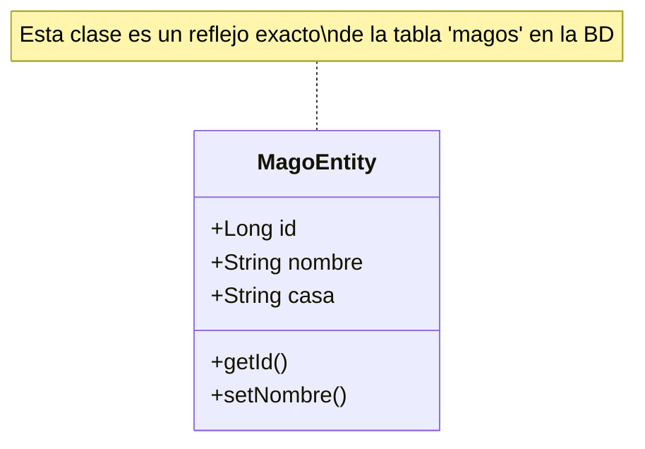
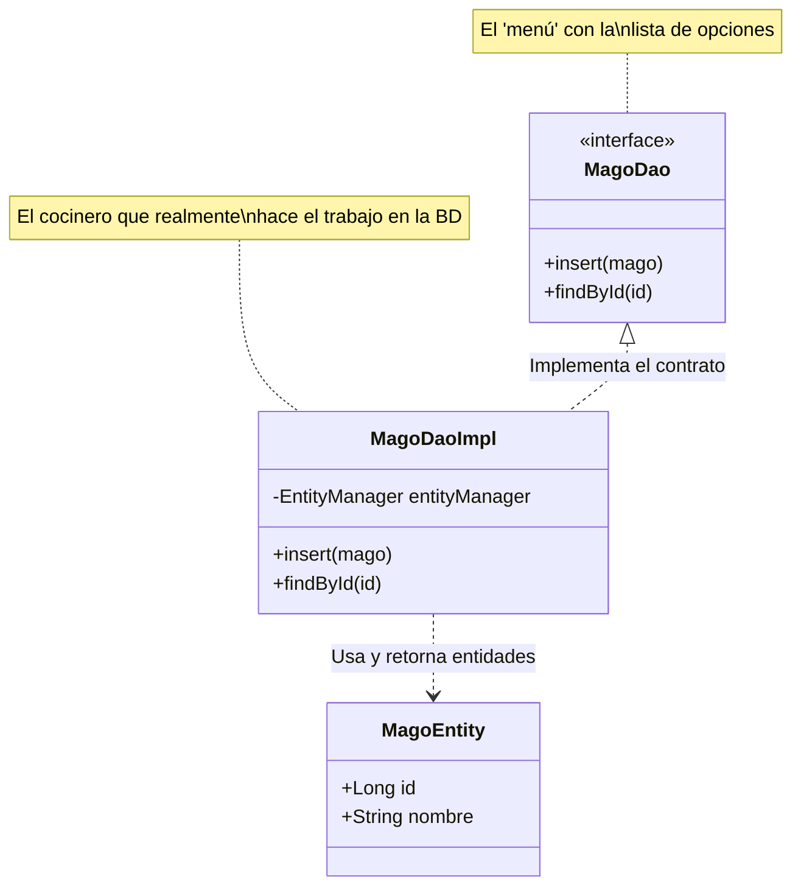
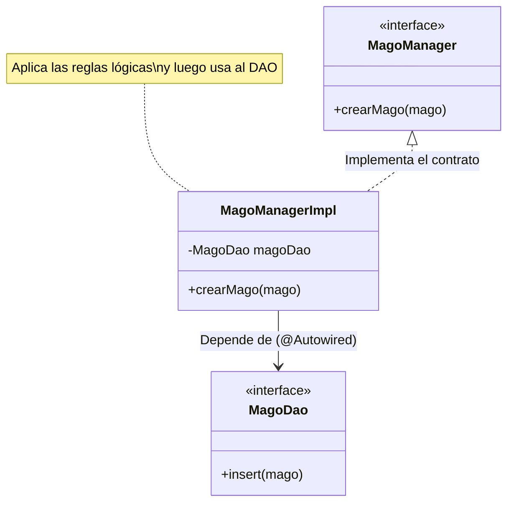
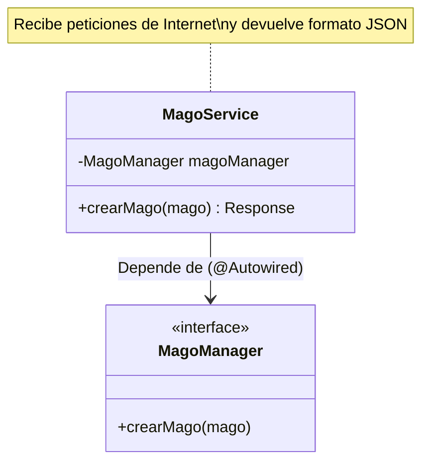
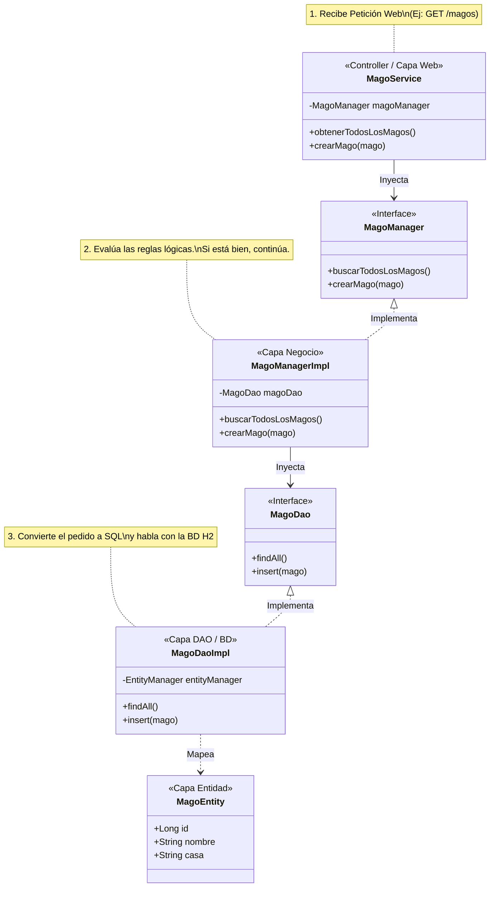
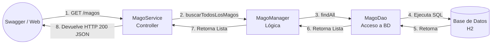

# 🏰 La Arquitectura del Colegio (Arquitectura por Capas)

En el mundo de la programación profesional, nunca escribimos todo nuestro código en un solo archivo gigante. Eso sería como construir un colegio donde la cocina, los baños, los salones y el rector están en una misma habitación. ¡Un desastre!

Para evitar el caos, utilizamos un patrón de diseño fundamental llamado **Arquitectura por Capas** (Layered Architecture). Esto significa que dividimos nuestra aplicación en "pisos" o "capas", donde cada capa tiene una responsabilidad única y exclusiva.

> [!NOTE]
> **Guía para leer los diagramas (UML)**
> A lo largo de este documento verás unos gráficos de "cajas y flechas". Son diagramas UML (Lenguaje Unificado de Modelado). Presta atención a los distintos tipos de flechas:
> - **Línea punteada con triángulo vacío (`<|..`)**: Significa **"Implementa"**. Es cuando una clase "firma un contrato" diciendo que va a hacer obligatoriamente todo lo que promete una Interfaz.
> - **Línea continua con flecha (`-->`)**: Significa **"Depende de"** o "Inyecta". Indica que un archivo necesita obligatoriamente del otro para funcionar permanentemente (como un carro necesita un motor).
> - **Línea punteada con flecha (`..>`)**: Significa **"Usa temporalmente"**. Indica que un archivo simplemente utiliza a otro por un ratico, por ejemplo, para pasarlo como respuesta o llenar sus datos (crear un objeto).

---

## 1. La Capa de Modelos (Entities)

**¿Para qué la usamos?**
Para representar las "Cosas" de nuestro sistema. Si estuviéramos haciendo un juego, serían los personajes, las espadas y las pociones. En nuestro caso, representan las tablas de la Base de Datos como objetos de Java.

**¿Por qué la usamos?**
Porque a los humanos (y a Java) se nos hace muy difícil pensar en filas y columnas de bases de datos. Es mucho más natural pensar en un objeto `MagoEntity` que tiene propiedades como `nombre` y `casa`.

**Patrón principal utilizado:** Data Transfer Object (DTO) o Entidad de Dominio. 

---

## 2. La Capa de Acceso a Datos (DAO / Repositories)

**¿Para qué la usamos?**
Para que sea el **ÚNICO** lugar del sistema autorizado para comunicarse con la Base de Datos. Nadie más tiene permiso para ejecutar un `SELECT` o un `INSERT`.

**¿Por qué la usamos?**
Imagina que un día decidimos cambiar la base de datos de "H2" a "MySQL" o "PostgreSQL". Si tuviéramos consultas SQL regadas por todos los archivos, tendríamos que reescribir todo el sistema. Al tener la capa DAO, **solo** actualizamos los archivos DAO y el resto del programa ni se entera del cambio.

**Patrón principal utilizado:** Repository (Repositorio). Nos permite tratar la base de datos como si fuera una simple colección de objetos de Java.

**¿Cómo se integra?**
El DAO utiliza los objetos de la capa Modelo para transportarlos hacia y desde la base de datos.

---

## 3. La Capa de Lógica de Negocio (Managers / Services)

**¿Para qué la usamos?**
Aquí viven las "Reglas de Negocio" o "Reglas del Colegio". Es el cerebro de la aplicación. Por ejemplo, validar que un mago no tenga nombre vacío, o que un hechizo oscuro no sea aceptado.

**¿Por qué la usamos?**
Para que la base de datos no se llene de "basura". Como explicamos en clase, la base de datos es pasiva (solo guarda lo que le mandan). El Manager actúa como un guardia de seguridad que inspecciona los datos, aplica cálculos, validaciones lógicas, y solo si todo está perfecto, autoriza llamar al DAO para guardar la información.

**Patrón principal utilizado:** Fachada (Facade) y Servicio de Negocio. Además de **Inyección de Dependencias (Dependency Injection)**. A través de `@Autowired`, Spring nos inyecta el DAO automáticamente aplicando el patrón **Singleton** (Solo existe una instancia del DAO en toda la aplicación).

**¿Cómo se integra?**
El Manager requiere (`@Autowired`) del DAO para funcionar. Cuando el Manager termina sus validaciones lógicas, le pasa la entidad al DAO.

---

## 4. La Capa de Presentación o Servicios Web (Controllers)

**¿Para qué la usamos?**
Para exponer nuestras funciones al mundo exterior. Esta capa es la "Puerta del Colegio". Recibe peticiones HTTP desde el exterior (ej. desde una app móvil, un frontend de React, o Swagger) y devuelve respuestas con códigos HTTP (200, 404, 500).

**¿Por qué la usamos?**
Porque necesitamos traducir el idioma de "Internet" (Peticiones HTTP con JSON) al idioma de "Java" (Objetos). El Controlador se encarga exclusivamente de recibir el paquete web, destaparlo, dárselo al Manager, y luego empacar la respuesta de vuelta al usuario. **Jamás debe tener reglas lógicas**.

**Patrón principal utilizado:** Controlador RESTful. También se integra fuertemente con la **Inyección de Dependencias** para acceder al Manager.

**¿Cómo se integra?**
El Controlador recibe la petición HTTP (ej: `@POST`), inyecta el Manager, le entrega los datos y arma la respuesta HTTP final (`Response`).

---

## 🌎 Visión General del Sistema (Diagrama Final Integrado)

Finalmente, si unimos todas las piezas del rompecabezas, nuestro sistema completo se ve así. 
Observa cómo **MagoService** pide ayuda a **MagoManager**, y **MagoManager** a su vez pide ayuda a **MagoDao**, el cual crea a **MagoEntity**. 

> **Regla Sagrada:** ¡Las capas nunca pueden saltarse una a la otra! Un Controlador jamás puede llamar al DAO, siempre debe pedirle permiso al Manager.

### ¿Cómo viaja la información? (Flujograma de Ejemplo)

Cuando un estudiante pide ver la lista de magos a través de Swagger, el flujo de llamadas cruza todas las capas como si fuera una carrera de relevos:

¡Comprender esta separación te dará el poder para crear aplicaciones que miles de usuarios puedan usar sin que se derrumben!
