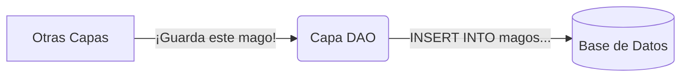
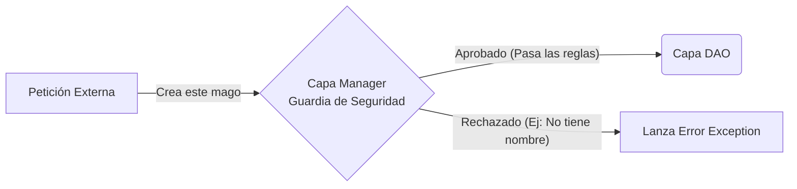
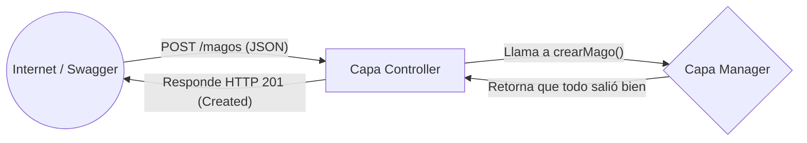
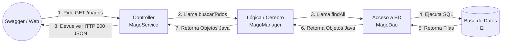

# 🏰 La Arquitectura del Colegio (Arquitectura por Capas)

En el mundo de la programación profesional, nunca escribimos todo nuestro código en un solo archivo gigante. Eso sería como construir un colegio donde la cocina, los baños, los salones y el rector están en una misma habitación. ¡Un desastre!

Para evitar el caos, utilizamos un patrón de diseño fundamental llamado **Arquitectura por Capas** (Layered Architecture). Esto significa que dividimos nuestra aplicación en "pisos" o "capas", donde cada capa tiene una responsabilidad única y exclusiva.

---

## 1. La Capa de Modelos (Entities) - *Reto 1*

**¿Para qué la usamos?**
Para representar las "Cosas" de nuestro sistema. En nuestro caso, representan las tablas de la Base de Datos como objetos de Java. A los humanos (y a Java) se nos hace muy difícil pensar en filas y columnas, es más fácil pensar en un objeto `Mago`.

En lugar de usar diagramas complejos, veamos directamente **el código real** que usamos para esto. Presta atención a las "Anotaciones" (las palabras con `@`), ¡son las que hacen la magia!

```java
// @Entity le dice a Java: "¡Conviérteme en una tabla de Base de Datos!"
@Entity
// @Table le asigna el nombre exacto a la tabla.
@Table(name = "magos") 
public class MagoEntity {

    // @Id indica que esta es la "cédula" o identificador único del mago.
    @Id 
    // @GeneratedValue hace que la BD asigne el número sola (1, 2, 3...)
    @GeneratedValue(strategy = GenerationType.IDENTITY) 
    private Long id;

    // @Column amarra esta variable a la columna "nombre" en la BD.
    @Column(name = "nombre", nullable = false) 
    private String nombre;

    private String casa;

    // ... (Aquí van los Getters y Setters obligatorios)
}
```

---

## 2. La Capa de Acceso a Datos (DAO / Repositories) - *Reto 2*

**¿Para qué la usamos?**
Para que sea el **ÚNICO** lugar del sistema autorizado para hablar con la Base de Datos. Nadie más tiene permiso para ejecutar un `SELECT` o un `INSERT`.



**Veamos el código en acción:**
Fíjate cómo usamos el `EntityManager` para enviar órdenes a la base de datos sin tener que escribir tanto SQL manual.

```java
// @Repository le avisa a Spring que este archivo es el experto en Bases de Datos
@Repository
public class MagoDaoImpl implements MagoDao {

    // El EntityManager es nuestro "traductor" de Java a Base de Datos
    @PersistenceContext
    private EntityManager entityManager;

    @Override
    public void insert(MagoEntity mago) {
        // persist() guarda el objeto en la BD automáticamente.
        // Es igual a hacer: INSERT INTO magos (nombre, casa) VALUES (...)
        entityManager.persist(mago);
    }
    
    // ... otros métodos de base de datos
}
```

---

## 3. La Capa de Lógica de Negocio (Managers / Services) - *Reto 3*

**¿Para qué la usamos?**
Aquí viven las "Reglas del Colegio". Es el **cerebro**. Por ejemplo, validar que un mago no tenga nombre vacío. El Manager actúa como un guardia de seguridad que inspecciona los datos antes de dárselos al DAO.



**El código en acción:**
Observa cómo el Manager aplica las reglas (los `if`) y, solo si todo está bien, llama al DAO (`magoDao.insert`).

```java
// @Service indica que aquí viven las REGLAS DE NEGOCIO
@Service
public class MagoManagerImpl implements MagoManager {

    // @Autowired "Inyecta" el DAO mágicamente para poder usarlo aquí
    @Autowired
    private MagoDao magoDao;

    @Override
    public void crearMago(MagoEntity mago) throws Exception {
        // REGLA DE NEGOCIO: Validamos que el nombre exista
        if (mago.getNombre() == null || mago.getNombre().isEmpty()) {
            throw new Exception("El mago debe tener un nombre válido");
        }
        
        // Si el guardia de seguridad aprueba, se lo pasamos al DAO
        magoDao.insert(mago);
    }
}
```

---

## 4. La Capa de Presentación o API (Controllers) - *Reto 4*

**¿Para qué la usamos?**
Es la "Puerta del Colegio". Recibe peticiones HTTP desde el exterior (Internet, Swagger, Apps Móviles) y devuelve respuestas con códigos (200 OK, 400 Error). **Jamás debe tener reglas lógicas**.



**El código en acción:**
Nota cómo usamos anotaciones para definir la URL (`@Path`) y el tipo de petición (`@POST`, `@GET`).

```java
// @Path define la URL de esta puerta. Ej: localhost:8080/magos
@Path("/magos")
@Component
public class MagoService {

    // Nos traemos el Manager (nuestro cerebro)
    @Autowired
    private MagoManager magoManager;

    // @POST se usa en Internet para "Crear" cosas nuevas
    @POST
    public Response crearMago(MagoEntity mago) {
        try {
            // Le pasamos el paquete al Manager
            magoManager.crearMago(mago);
            // Si todo sale bien, respondemos Código HTTP 201 (Creado)
            return Response.status(Response.Status.CREATED).entity("¡Mago creado!").build();
        } catch (Exception e) {
            // Si el Manager lanzó un error, respondemos Código HTTP 400 (Petición Mala)
            return Response.status(Response.Status.BAD_REQUEST).entity(e.getMessage()).build();
        }
    }
}
```

---

## 🌎 Visión General del Sistema (El Viaje de la Petición)

Cuando un estudiante usa Swagger para pedir la lista de magos, el flujo de llamadas cruza todas las capas como si fuera una carrera de relevos. 

> **Regla Sagrada:** ¡Las capas nunca pueden saltarse una a la otra! Un Controlador jamás puede llamar al DAO, siempre debe pedirle permiso al Manager.



¡Comprender esta separación te dará el poder para crear aplicaciones que miles de usuarios puedan usar sin que se derrumben!
