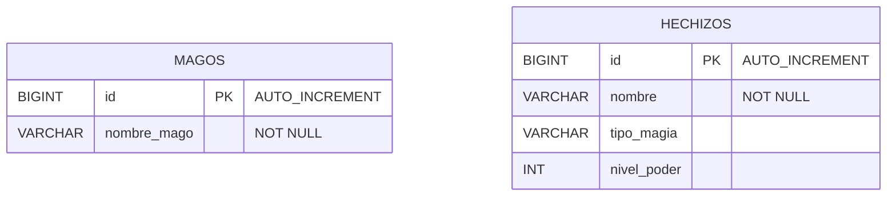

# 📊 Diagrama de Base de Datos

Aquí puedes ver la estructura de la base de datos mágica que estamos construyendo. 
En Spring Boot, **NO** creamos estas tablas manualmente en SQL. Nosotros creamos clases Java (`Models` / `Entities`) y el motor (Hibernate) construye las tablas por nosotros basándose en las anotaciones (`@Entity`, `@Table`, `@Id`, etc.).

### 🧙‍♂️ Sobre el modelo `MAGOS`
Esta será la tabla que construirás junto con tu profesor en el **Reto 0**. Verás cómo crear la clase `MagoEntity` y mapear sus campos.

### ✨ Sobre el modelo `HECHIZOS`
Esta es la tabla que **TÚ** deberás configurar en el **Reto 1**. Debes asegurarte de que la clase `HechizoEntity` se traduzca exactamente en esta tabla, siguiendo las reglas establecidas para los nulos (`NOT NULL`) y las llaves primarias (`PK`).
